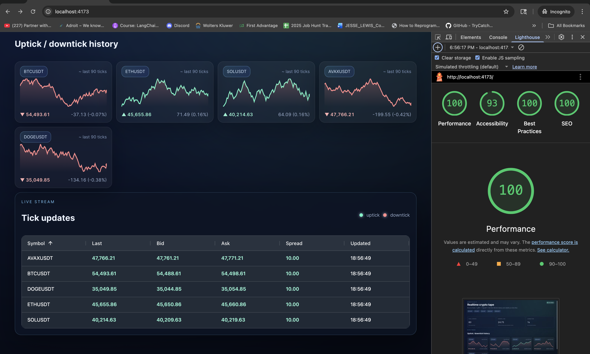
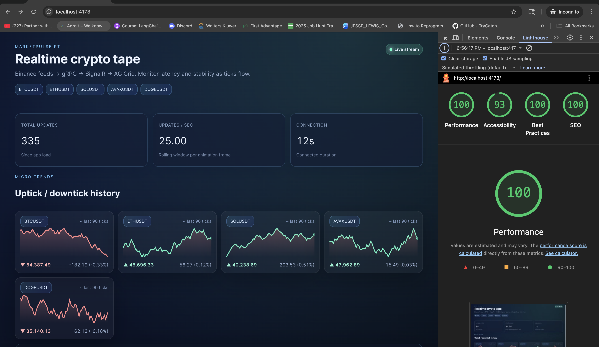

# MarketPulse RT – Realtime Trading Dashboard (React + .NET 10)

## Goal

Build a production-grade, portfolio-ready real-time trading-style dashboard that showcases:

- Advanced **C# / .NET 10** skills (Web API, worker service, gRPC, SignalR)
- **React + TypeScript** front-end architecture with a **custom design system**
- High-frequency real-time data handling using **SignalR**, **WebSockets**, and **gRPC**
- Performance-focused **data grid** implementation (AG Grid) with frequent updates
- A **polyglot monorepo** layout (Turborepo + Yarn 4 workspaces + .NET solution)
- Containerization with **Docker** and cloud-readiness (Terraform structure for AWS)

## Concept

**MarketPulse RT** is a real-time crypto market operations dashboard:

- A .NET 10 **MarketDataService** connects to public crypto WebSocket feeds (e.g., Binance),
  normalizes data into strongly typed messages, and exposes a **gRPC streaming API**.
- A .NET 10 **ApiGateway** consumes that gRPC stream and fans out updates to clients via
  **SignalR hubs**, also exposing REST endpoints for snapshots and reference data.
- A React/TypeScript **Web Dashboard** displays streaming prices, order book data, and trade
  events in **AG Grid**, with a **custom design-system** that is optimized for performance:
  CSS-in-JS for shell + theming, static CSS for hot paths (grid cells).

### What is a “crypto tape” and why it’s useful (plain English)

- A **tape** is a live strip of prices, like the ticker tape at a stock exchange.
- Traders watch it to see momentum, spreads, and how stable a feed is under load.
- This app shows the latest price per symbol, a tiny history sparkline, and the connection stats so you can tell if the stream is healthy.

## High-level Architecture

- **Frontend**

  - `apps/web-dashboard`: Vite + React + TS app
  - `packages/design-system`: Emotion + Styled System-based design system
  - `packages/web-state`: shared SignalR client, state management (Zustand), hooks
  - `packages/shared-contracts`: TS types generated from proto/OpenAPI

- **Backend (.NET 10)**

  - `apps/ApiGateway`: ASP.NET Core Web API + SignalR + gRPC client to MarketDataService
  - `apps/MarketDataService`: .NET worker using WebSockets to ingest public market data,
    exposing a gRPC streaming service

- **Infra**
  - Dockerfiles for each app
  - `docker-compose.yml` for local dev
  - `infra/terraform` skeleton for AWS ECS Fargate + RDS + networking

## Key Tech Choices

- **.NET 10** (Web API, Worker, gRPC, SignalR)
- **React 18**, **TypeScript 5**, **Vite**
- **AG Grid** for high-performance, real-time tabular data
- **Yarn 4 + Turborepo** for monorepo orchestration
- **Emotion + Styled System** for design system tokens/composability
- **Zustand** (or Redux Toolkit) for normalized client-side state
- **Docker** for containerization, **Terraform** for AWS-ready infra skeleton

## How it works (end-to-end)

1. **Ingest** – MarketDataService subscribes to Binance trades (or uses the mock generator), normalizes ticks, and streams them over gRPC.
2. **Fan-out** – ApiGateway runs a background relay that consumes gRPC ticks and pushes them to connected clients over SignalR groups.
3. **Visualize** – The web dashboard subscribes to symbols, buffers ticks per animation frame, and renders them in AG Grid plus rolling sparklines.

This keeps payloads small, latency low, and isolates UI performance from backend burstiness.

### Same flow, in non-technical words (with the tools named)

1. **Collect prices (MarketDataService, C#/.NET 10 + gRPC):** a worker listens to the exchange feed and cleans each price into a consistent message. gRPC is the lane it uses to stream those messages out.
2. **Pass them along (ApiGateway, C#/.NET 10 + SignalR):** a relay receives the gRPC stream and immediately broadcasts each update to any browser that’s listening. SignalR is the lane to the browser.
3. **Show the tape (React + AG Grid + design system):** the web app buffers the newest price per symbol every animation frame, paints the live grid, and draws mini charts for the last ~90 ticks. The design system components keep the UI consistent and fast to render.

## Prerequisites (local dev)

- **.NET 10 SDK** (or latest preview matching this repo)
- **Node 18+** with **Corepack** enabled (Yarn 4 is declared in `packageManager`)
- **Docker Desktop** (for the compose setup)
- **Git** and a shell with `bash`/`zsh`

Enable Corepack once if needed:
```bash
corepack enable
```

## Bootstrap & run locally

1) **Install JS deps**
```bash
yarn install
```
This also restores the .NET projects unless `SKIP_DOTNET_RESTORE=1` is set.

2) **Set environment for MarketDataService**
- Copy the example file and tweak if you want Binance instead of mock data:
```bash
cp apps/market-data-service/.env.example apps/market-data-service/.env
# edit MarketData__Source=Binance to hit live Binance trades
```
- Docker Compose currently sets `MarketData__Source=Mock`; change that env in `docker-compose.yml` if you want live feed when running in containers.

3) **Run everything with Docker (recommended)**
```bash
docker-compose up --build
```
Services come up at:
- ApiGateway: `http://localhost:5100` (SignalR hub at `/hubs/market`)
- MarketDataService (gRPC): `http://localhost:5001`
- Web dashboard: `http://localhost:4173`

4) **Or run locally without Docker**
```bash
# Terminal 1: MarketDataService (honors apps/market-data-service/.env)
yarn dev:market-data

# Terminal 2: ApiGateway (expects MarketDataService at localhost:5001)
yarn dev:api-gateway

# Terminal 3: Web dashboard (uses VITE_API_BASE; defaults to http://localhost:5100)
yarn dev:web
```

## Stack highlights (what does what)

- **MarketDataService (C#/.NET 10)**
  - Worker service hosting the gRPC server and a background price feed (`PriceStreamBroadcaster`).
  - Pluggable sources: Binance WebSocket ingest or a mock generator, both pushing ticks into a shared channel.
  - gRPC service (`MarketDataStreamer`) streams normalized `TickerUpdate` messages to any consumer.
- **ApiGateway (C#/.NET 10)**
  - ASP.NET Core with **SignalR**: `MarketHub` groups connections per symbol.
  - Background relay (`MarketStreamerRelay`) dials the gRPC stream and fans updates to SignalR clients.
  - REST endpoints for snapshots and health alongside the real-time hub.
- **Web Dashboard (React + TypeScript)**
  - Vite + TS + AG Grid for the live tick table; buffering ticks per animation frame keeps updates smooth.
  - Rolling sparklines (~90 points) for each symbol.
  - **Design system** (`packages/design-system`): Emotion/Styled-System primitives (e.g., `Card`, `Pill`, layout tokens) to keep styling consistent and lightweight.
- **Monorepo tooling**
  - Turborepo + Yarn 4 workspaces orchestrate the React apps, shared packages, and .NET projects.
  - Docker/Docker Compose for local bring-up of the full pipeline (gRPC + SignalR + UI).

## Screenshots




